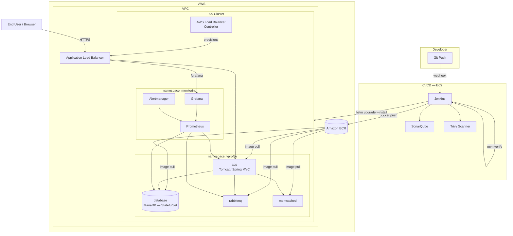
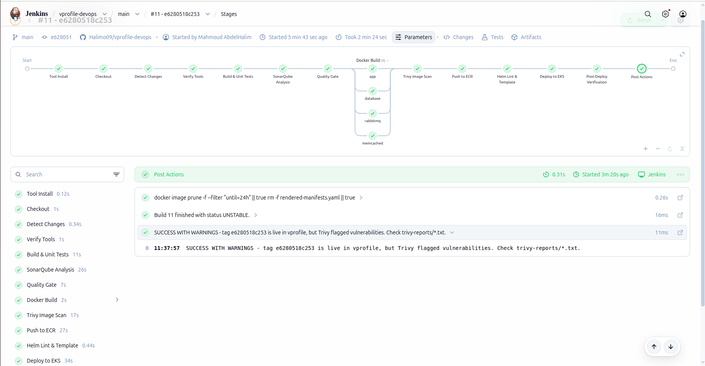
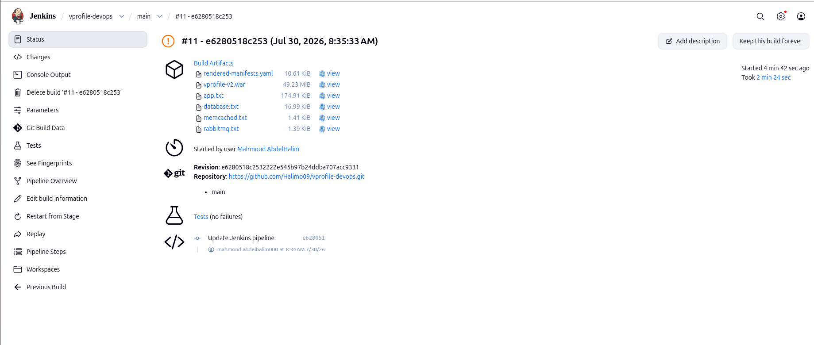
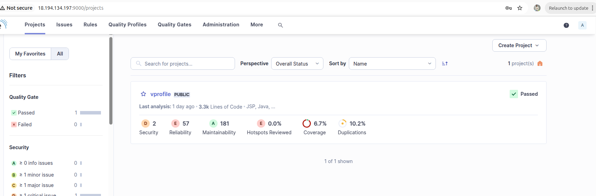
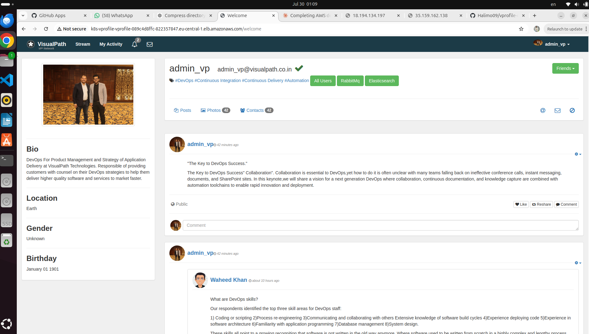
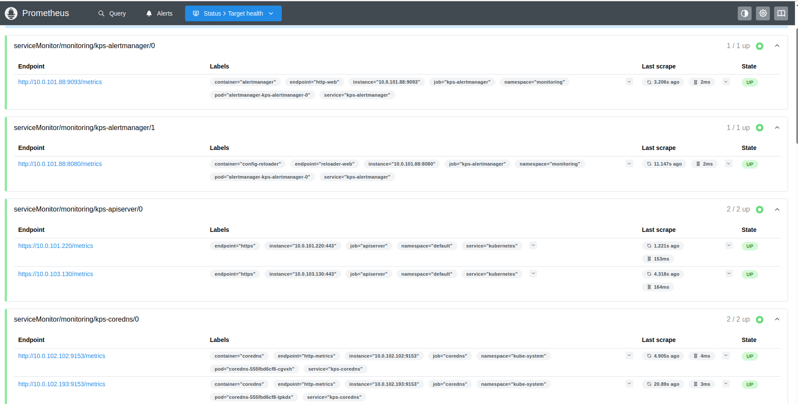
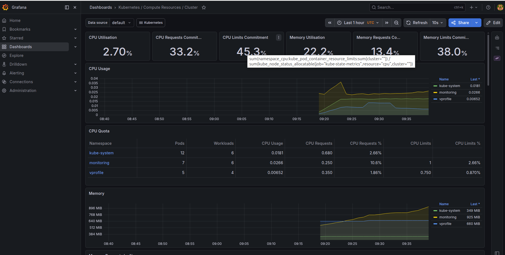
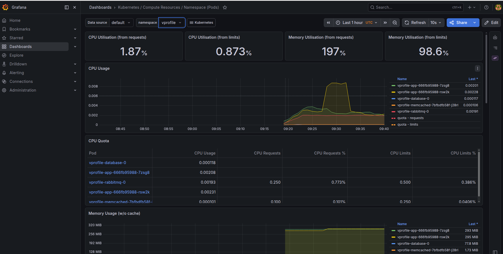

# VProfile — Cloud-Native DevOps Pipeline on AWS EKS

A Java web application deployed to Amazon EKS through a fully automated CI/CD pipeline — Jenkins builds and tests the code, SonarQube gates code quality, Trivy scans container images for vulnerabilities, and Helm ships the release to Kubernetes behind an AWS Application Load Balancer. Infrastructure is 100% Terraform.

<p align="left">
  
  
  
  
  
</p>

---

## Table of Contents

- [Overview](#overview)
- [Architecture](#architecture)
- [Tech Stack](#tech-stack)
- [Repository Structure](#repository-structure)
- [CI/CD Pipeline](#cicd-pipeline)
- [Screenshots](#screenshots)
- [Getting Started](#getting-started)
  - [Prerequisites](#prerequisites)
  - [1. Provision the Infrastructure](#1-provision-the-infrastructure)
  - [2. Build and Push the Images](#2-build-and-push-the-images)
  - [3. Deploy with Helm](#3-deploy-with-helm)
  - [4. Verify](#4-verify)
- [Monitoring](#monitoring)
- [Security](#security)
- [Known Limitations & Roadmap](#known-limitations--roadmap)
- [License](#license)

---

## Overview

VProfile is a Spring MVC user-profile web application, containerized and deployed as a set of Kubernetes workloads on Amazon EKS. This repository contains the **complete DevOps toolchain** around it:

- **Terraform** — VPC, EKS cluster, ECR repositories, IAM/IRSA roles, a Jenkins build host, the AWS Load Balancer Controller, and a Prometheus/Grafana monitoring stack.
- **Jenkins pipeline** — path-aware CI/CD that builds, tests, quality-gates, scans, and deploys only the components that actually changed.
- **Helm** — an umbrella chart composing the application, database, message queue, and cache into one release.
- **Kubernetes** — the app is reachable over the public internet through an ALB Ingress, with its own Grafana dashboard for observability.

---

## Architecture



**Request flow:** a user's browser hits the ALB → the AWS Load Balancer Controller-managed Ingress routes traffic to the `vprofile-app` Service → the app talks to MariaDB, RabbitMQ, and Memcached over ClusterIP Services inside the cluster.

**Deploy flow:** a `git push` triggers Jenkins → build & test → SonarQube quality gate → Docker build → Trivy scan → push to ECR → `helm upgrade --install` against the EKS cluster → automated rollout verification and a live smoke test.

---

## Tech Stack

| Layer | Technology |
|---|---|
| Application | Java, Spring MVC, Tomcat 9 |
| Database | MariaDB |
| Messaging | RabbitMQ |
| Caching | Memcached |
| Containers | Docker |
| Orchestration | Kubernetes (Amazon EKS 1.33) |
| Package management | Helm 3 |
| Infrastructure as Code | Terraform (AWS provider, Helm provider, Kubernetes provider) |
| CI/CD | Jenkins (Declarative Pipeline) |
| Code Quality | SonarQube |
| Vulnerability Scanning | Trivy |
| Ingress / Load Balancing | AWS Load Balancer Controller (ALB) |
| Container Registry | Amazon ECR |
| Storage | Amazon EBS (via EBS CSI driver, `gp3` StorageClass) |
| Monitoring | Prometheus, Grafana, Alertmanager (kube-prometheus-stack) |
| Identity | IAM Roles for Service Accounts (IRSA) via OIDC |

---

## Repository Structure

```
vprofile-devops/
├── source/                  # Java application source (Maven, WAR)
├── docker/                  # Dockerfiles — app, database, rabbitmq, memcached
├── helm/
│   ├── vprofile/             # Umbrella chart
│   └── charts/                # app, database, rabbitmq, memcached subcharts
├── kubernetes/               # Standalone manifests (Ingress, StorageClass)
├── terraform/
│   ├── modules/
│   │   ├── networking/        # VPC, subnets, NAT, routing
│   │   ├── eks/                # EKS cluster, node group, OIDC, EBS CSI IRSA
│   │   ├── ecr/                 # Container repositories
│   │   ├── iam/                  # IAM roles/policies
│   │   ├── jenkins/               # Jenkins/SonarQube EC2 host
│   │   ├── lb-controller-irsa/     # AWS Load Balancer Controller IRSA role
│   │   └── monitoring/              # kube-prometheus-stack Helm release
│   └── live/dev/                     # Environment composition (dev)
├── docs/                     # Documentation & screenshots
├── Jenkinsfile                # CI/CD pipeline definition
└── README.md
```

---

## CI/CD Pipeline

The Jenkins pipeline is **path-aware**: it inspects which files changed since the last successful build and only rebuilds/redeploys the components affected, unless a full run is forced.

| Stage | What it does |
|---|---|
| Checkout | Pulls the commit, derives the image tag from the Git SHA |
| Detect Changes | Decides which of app/database/rabbitmq/memcached need rebuilding |
| Build & Unit Tests | `mvn clean verify` — compiles, runs unit tests, produces the WAR |
| SonarQube Analysis | Static analysis — bugs, code smells, security hotspots, coverage |
| Quality Gate | Blocks the pipeline if SonarQube's quality gate fails |
| Docker Build | Builds only the images whose inputs changed, in parallel |
| Trivy Image Scan | Scans every built image for HIGH/CRITICAL CVEs; results are archived as reports |
| Push to ECR | Pushes newly built images to their Amazon ECR repositories |
| Helm Lint & Template | Validates the chart renders correctly before touching the cluster |
| Deploy to EKS | `helm upgrade --install --atomic` — automatic rollback on failure |
| Post-Deploy Verification | Waits for rollout, checks Service endpoints, runs an in-cluster smoke test against `/login` |

A successful run looks like this:



Every build archives its test results, the packaged WAR, and the Trivy vulnerability reports as artifacts:



---

## Screenshots

**SonarQube — code quality gate passed:**



**The application, live on the internet behind the ALB:**



---

## Getting Started

### Prerequisites

- An AWS account with permissions to create VPCs, EKS clusters, IAM roles, EC2 instances, and ECR repositories
- [Terraform](https://developer.hashicorp.com/terraform/downloads) ≥ 1.12
- [AWS CLI](https://docs.aws.amazon.com/cli/) v2, configured (`aws configure`)
- [kubectl](https://kubernetes.io/docs/tasks/tools/), [Helm](https://helm.sh/docs/intro/install/) 3, [Docker](https://docs.docker.com/get-docker/)
- An S3 bucket + DynamoDB table for Terraform remote state (referenced in `terraform/live/dev/backend.tf`)

### 1. Provision the Infrastructure

```bash
cd terraform/live/dev
terraform init
terraform apply
```

This single `apply` provisions, in dependency order:

1. VPC, public/private subnets, NAT gateway
2. EKS cluster + managed node group + OIDC provider
3. The `gp3` default StorageClass
4. ECR repositories for all four images
5. IRSA role + Helm release for the AWS Load Balancer Controller
6. The Jenkins/SonarQube EC2 host
7. The Prometheus/Grafana monitoring stack

Grab the Jenkins host's address and the Grafana admin password from the outputs:

```bash
terraform output jenkins_public_ip
terraform output -raw grafana_admin_password
```

### 2. Build and Push the Images

In normal use, Jenkins does this for you on every push. To do it manually:

```bash
aws ecr get-login-password --region eu-central-1 \
  | docker login --username AWS --password-stdin <account-id>.dkr.ecr.eu-central-1.amazonaws.com

docker build -f docker/app/Dockerfile       -t <registry>/vprofile/app:<tag>       .
docker build -f docker/database/Dockerfile  -t <registry>/vprofile/database:<tag>  .
docker build -f docker/rabbitmq/Dockerfile  -t <registry>/vprofile/rabbitmq:<tag>  .
docker build -f docker/memcached/Dockerfile -t <registry>/vprofile/memcached:<tag> .

docker push <registry>/vprofile/app:<tag>
docker push <registry>/vprofile/database:<tag>
docker push <registry>/vprofile/rabbitmq:<tag>
docker push <registry>/vprofile/memcached:<tag>
```

### 3. Deploy with Helm

```bash
aws eks update-kubeconfig --region eu-central-1 --name vprofile-dev-eks

helm dependency update helm/vprofile
helm upgrade --install vprofile helm/vprofile \
  --namespace vprofile --create-namespace \
  --set app.image.tag=<tag> \
  --set database.image.tag=<tag> \
  --set rabbitmq.image.tag=<tag> \
  --set memcached.image.tag=<tag>

kubectl apply -f kubernetes/app-ingress.yaml
```

### 4. Verify

```bash
kubectl -n vprofile get pods
kubectl -n vprofile get ingress vprofile-app   # ADDRESS column = your ALB DNS name
```

Open the ALB address shown above in a browser — you should land on the VProfile welcome page.

---

## Monitoring

Prometheus, Grafana, and Alertmanager are deployed via Terraform (`terraform/modules/monitoring`) into the `monitoring` namespace, with node-level and pod-level metrics collected automatically across the whole cluster — no changes to the application are required.

**Prometheus is actively scraping every workload in the cluster** — the app, the database, RabbitMQ, Memcached, the control plane, and its own monitoring stack, all reporting `UP`:



**Cluster-wide resource usage in Grafana**, broken down by namespace (`vprofile`, `monitoring`, `kube-system`):



**Zooming into the `vprofile` namespace specifically** — live CPU/memory for the actual application Pods (`vprofile-app`, `vprofile-database`, `vprofile-rabbitmq`, `vprofile-memcached`):



### Accessing it

The quickest way in, no DNS setup required:

```bash
aws eks update-kubeconfig --region eu-central-1 --name vprofile-dev-eks
kubectl port-forward -n monitoring svc/kps-grafana 3000:80
```

Open `http://localhost:3000` and log in with:
- **Username:** `admin`
- **Password:** `terraform output -raw grafana_admin_password`

For access without a local tunnel (e.g. to share it), the Grafana Ingress is also reachable through its ALB:

```bash
kubectl get ingress -n monitoring kps-grafana
```

Since no real DNS is pointed at it yet, that ALB only responds to the `Host: grafana.vprofile.local` header — either curl it directly with `-H`, or map that hostname to the ALB's address in your local hosts file for normal browser access.

---

## Security

- **SonarQube** gates every build on code quality, bugs, and security hotspots before it's allowed to proceed.
- **Trivy** scans every container image for HIGH/CRITICAL CVEs with available fixes. Findings are archived as build artifacts (`trivy-reports/*.txt`) on every run; the build is currently marked **unstable** (not blocked) on findings so the team can review and remediate on its own cadence rather than being hard-blocked mid-release.
- **IRSA** (IAM Roles for Service Accounts) is used throughout instead of broad node-level IAM permissions — the EBS CSI driver and the AWS Load Balancer Controller each run with their own least-privilege role.

---

## Known Limitations & Roadmap

This project is under active hardening. Currently known gaps:

- [ ] `memcached` Service currently has no backing Deployment — the Service exists but resolves no endpoints.
- [ ] Application secrets (DB/RabbitMQ credentials) are still set directly in Helm values rather than sourced from a secrets manager (e.g. Vault, AWS Secrets Manager).
- [ ] Trivy is currently in report-only mode; re-enable `TRIVY_FAIL_BUILD=true` in the Jenkinsfile once the existing CVE backlog is cleared.
- [ ] No dedicated Elasticsearch or NGINX/web frontend tier — the current deployment is a 4-service (app/database/rabbitmq/memcached) topology.
- [ ] Application dependencies are current as of this writing, but the app targets `javax.*`/Spring 5.x rather than the newer Jakarta/Spring 6+ line — a larger migration to track separately.

---

#author 
Mahmoud AbdelHalim 
mahmoud.abdelhalim000@gmail.com

